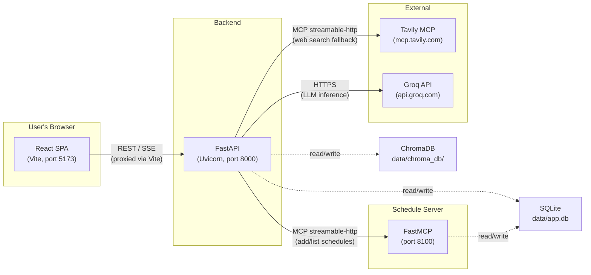
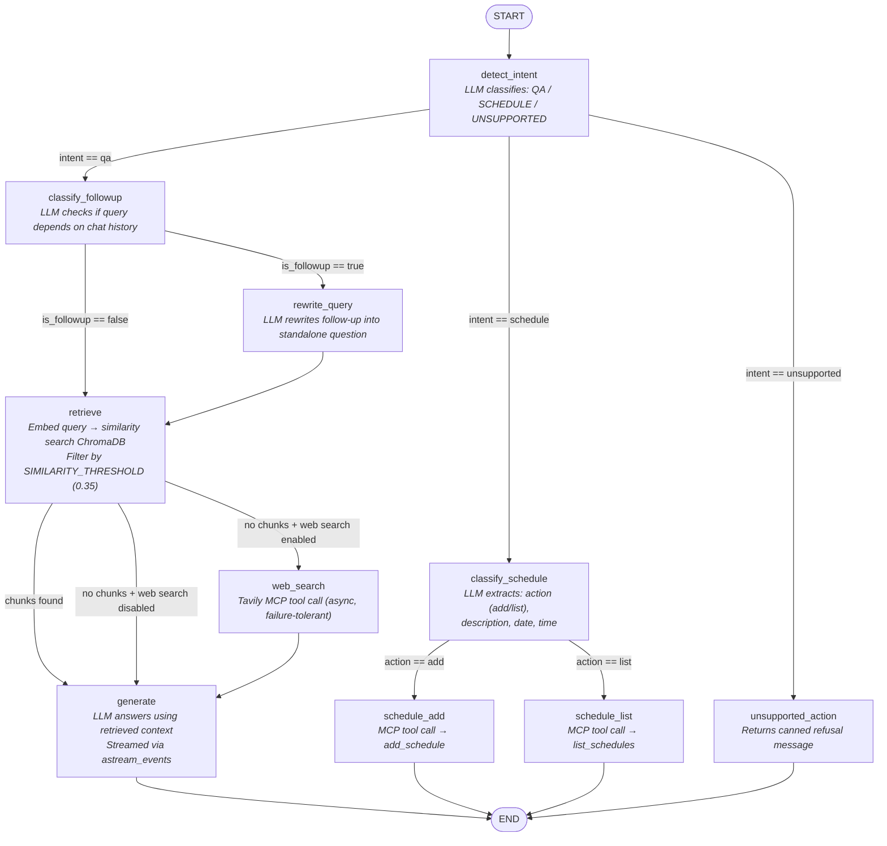

# Architecture

Technical reference for the Agentic RAG Platform. This document covers every layer of the system — from the technologies used, through the data that flows and is stored, to exactly what would need to change to take it to production.

> For a conceptual introduction and startup guide, see [README.md](README.md).

---

## Table of Contents

1. [Technology Stack](#1-technology-stack)
2. [System Overview — Three Processes](#2-system-overview--three-processes)
3. [Backend Layer Diagram](#3-backend-layer-diagram)
4. [API Surface](#4-api-surface)
5. [Authentication & Authorization](#5-authentication--authorization)
6. [The Agentic LangGraph Pipeline](#6-the-agentic-langgraph-pipeline)
7. [Document Ingestion Pipeline](#7-document-ingestion-pipeline)
8. [Data Storage — What Lives Where](#8-data-storage--what-lives-where)
9. [MCP Integration — How the Backend Talks to External Tools](#9-mcp-integration--how-the-backend-talks-to-external-tools)
10. [Frontend Architecture](#10-frontend-architecture)
11. [Key Abstractions & Extension Points](#11-key-abstractions--extension-points)
12. [Error Handling](#12-error-handling)
13. [Logging](#13-logging)
14. [Testing](#14-testing)
15. [Production Readiness Checklist](#15-production-readiness-checklist)

---

## 1. Technology Stack

### Backend (Python 3.11+)

| Category | Technology | Role |
|---|---|---|
| Web framework | **FastAPI** (0.115) + **Uvicorn** | Async HTTP server, OpenAPI docs, dependency injection |
| Orchestration | **LangGraph** | Compiles the agentic query pipeline into a stateful DAG |
| LLM inference | **Groq** (via `langchain-groq`) | Hosts Llama 3.3 70B — fast, free-tier inference API |
| Prompt composition | **LangChain Core** | `ChatPromptTemplate ` \| `ChatGroq` \| `StrOutputParser` chains |
| Embeddings | **SentenceTransformers** (`all-MiniLM-L6-v2`) | Local, offline embedding model — 384-dim vectors |
| Vector store | **ChromaDB** (0.5) | Persistent on-disk vector index with cosine similarity |
| Document loaders | **PyPDF**, **docx2txt**, LangChain `TextLoader` | PDF, DOCX, TXT, MD extraction |
| Text splitting | LangChain `RecursiveCharacterTextSplitter` | 1000-char chunks with 200-char overlap |
| MCP client | **langchain-mcp-adapters** + **mcp** SDK | Streamable-HTTP transport to MCP servers |
| Database ORM | **SQLAlchemy** 2.0 (async) + **aiosqlite** | Users, tokens, chat sessions, messages |
| Auth | **PyJWT** + **Passlib** (Argon2) | JWT access tokens + opaque refresh tokens in HttpOnly cookies |
| Validation | **Pydantic** v2 + **pydantic-settings** | Request/response schemas, `.env` configuration |

### Schedule MCP Server (Python — standalone process)

| Category | Technology | Role |
|---|---|---|
| MCP framework | **FastMCP** (`mcp` SDK) | Registers tools, serves them over streamable-HTTP |
| Database | **SQLAlchemy** 2.0 + **aiosqlite** | Reads/writes the `schedules` table in the shared SQLite file |
| Config | **pydantic-settings** | Its own `.env` file, separate from the main app |

### Frontend (Node.js 18+)

| Category | Technology | Role |
|---|---|---|
| Framework | **React** 19 + **Vite** 8 | SPA with HMR development server |
| UI library | **Ant Design** v6 + **@ant-design/x** | Layout, forms, buttons, chat bubbles |
| Routing | **React Router** v7 | Client-side routing with protected routes |
| HTTP client | **Axios** | JSON requests with interceptor-based silent token refresh |
| SSE streaming | Raw `fetch()` + custom reader | Reads `text/event-stream` from the `/chat` endpoint |
| Markdown | **react-markdown** + **remark-gfm** | Renders LLM output as formatted Markdown |
| Dev proxy | Vite `server.proxy` | Forwards `/api/v1/*` to `localhost:8000` during development |

---

## 2. System Overview — Three Processes

The platform runs as three independent processes that communicate over HTTP:



| Process | Default Port | Command | Purpose |
|---|---|---|---|
| **Schedule MCP Server** | `8100` | `python -m schedule_mcp_server.server` | Exposes `add_schedule` / `list_schedules` tools via MCP |
| **FastAPI Backend** | `8000` | `uvicorn app.main:app --reload --port 8000` | All business logic, auth, RAG pipeline, SSE streaming |
| **Vite Dev Server** | `5173` | `cd frontend && npm run dev` | Serves the React SPA, proxies API calls to port 8000 |

Both backend processes share a single SQLite database file (`data/app.db`) but own different tables — the backend owns `users`, `refresh_tokens`, `chat_sessions`, and `chat_messages`; the schedule server owns `schedules`.

---

## 3. Backend Layer Diagram

Dependencies flow strictly downward. No layer reaches back up.

```
HTTP request
  → app/main.py                 FastAPI app + lifespan (builds AppState once)
  → app/api/routes.py           Router — includes endpoint sub-routers
  → app/api/endpoints/*.py      Individual endpoint handlers (auth, chat, documents, sessions, health)
  → app/api/deps.py             Dependency providers (singletons from AppState + per-request DB services)
  → app/controllers/*.py        Orchestrate multi-step business logic
  → app/services/*.py           Single-responsibility domain logic
  → app/vectorstores/*.py       Vector store abstraction + Chroma implementation
  → app/db/*.py                 SQLAlchemy engine, ORM models, session factory
  → app/core/*.py               Security, exceptions, logging, MCP client abstraction
  → app/graph/*.py              LangGraph state definition, node factories, graph compilation
```

### Startup Sequence (Lifespan)

When Uvicorn starts the app, the `lifespan` context manager in [main.py](app/main.py) runs:

1. **`init_db()`** — Creates SQLAlchemy tables (`users`, `refresh_tokens`, `chat_sessions`, `chat_messages`) via `Base.metadata.create_all` if they don't exist.
2. **`build_app_state()`** — The composition root in [state.py](app/state.py) constructs all singletons:
   - `EmbeddingService` — loads the SentenceTransformer model into memory (~90 MB, first run downloads from HuggingFace).
   - `IngestionService` — configured with chunk size/overlap from settings.
   - `LLMService` — creates the Groq `ChatGroq` client and all five prompt chains.
   - `ChromaVectorStore` — opens the persistent Chroma collection from `data/chroma_db/`.
   - `RetrievalService` — wired to the vector store and embedding service.
   - `WebSearchService` — wraps a `ExternalMCPClient` pointed at Tavily's MCP endpoint.
   - `ScheduleService` — wraps a second `ExternalMCPClient` pointed at `localhost:8100/mcp`.
   - `DocumentController` — orchestrates ingestion (load → chunk → embed → store).
   - `ChatController` — compiles the LangGraph and exposes `astream_answer()`.

3. The `AppState` dataclass is stored on `app.state.rag`, accessible to every request via FastAPI's `Depends`.

On shutdown, `engine.dispose()` cleanly closes all pooled database connections.

---

## 4. API Surface

All endpoints are mounted under the `/api/v1` prefix.

### Auth (`/api/v1/auth`)

| Method | Path | Auth | Description |
|---|---|---|---|
| `POST` | `/auth/register` | — | Create a new user account |
| `POST` | `/auth/login` | — | OAuth2 form login → returns access token + sets refresh cookie |
| `POST` | `/auth/refresh` | Cookie | Exchange refresh token for a new token pair (rotation) |
| `POST` | `/auth/logout` | Cookie | Revoke the refresh token and clear the cookie |
| `GET` | `/auth/me` | Bearer | Return the current user's profile |

### Chat (`/api/v1/chat`)

| Method | Path | Auth | Description |
|---|---|---|---|
| `POST` | `/chat` | Bearer | Stream a chat response as SSE events (`session`, `status`, `token`, `done`, `error`) |

### Chat Sessions (`/api/v1/sessions`)

| Method | Path | Auth | Description |
|---|---|---|---|
| `GET` | `/sessions` | Bearer | List the current user's chat sessions (most recent first) |
| `GET` | `/sessions/{id}/messages` | Bearer | Retrieve full message history for a session |
| `PATCH` | `/sessions/{id}` | Bearer | Rename a session |
| `DELETE` | `/sessions/{id}` | Bearer | Delete a session and all its messages |

### Documents (`/api/v1/documents`)

| Method | Path | Auth | Description |
|---|---|---|---|
| `POST` | `/documents` | Admin | Upload and ingest a document (multipart file) |
| `GET` | `/documents` | Bearer | List all ingested documents (aggregated from Chroma metadata) |
| `DELETE` | `/documents/{id}` | Admin | Delete all chunks belonging to a document |

### Health (`/api/v1/health`)

| Method | Path | Auth | Description |
|---|---|---|---|
| `GET` | `/health` | — | Returns status, vector store provider name, and chunk count |

---

## 5. Authentication & Authorization

### Token Strategy

```
┌─────────────────────────────────────────────────────────┐
│                     Access Token (JWT)                  │
│  • Short-lived (30 min default)                         │
│  • Self-contained: verified without DB round trip       │
│  • Payload: {sub: user_id, type:"access", exp, iat, jti}│
│  • Sent as Bearer header on every API request           │
│  • Stored in-memory in the frontend (never localStorage)│
└─────────────────────────────────────────────────────────┘

┌─────────────────────────────────────────────────────────┐
│                  Refresh Token (Opaque)                 │
│  • Long-lived (14 days default)                         │
│  • Random string (secrets.token_urlsafe(48))            │
│  • Only the SHA-256 hash is stored in the DB            │
│  • Delivered as an HttpOnly, SameSite=Lax cookie        │
│  • Scoped to /api/v1/auth path only                     │
│  • Single-use: rotated on every refresh                 │
└─────────────────────────────────────────────────────────┘
```

**Password hashing** uses Argon2 via `passlib`, the winner of the Password Hashing Competition — not bcrypt.

### Authorization

- **`get_current_user`** dependency: Decodes the Bearer JWT, looks up the user in the DB, and verifies `is_active`. Any failure raises `AuthenticationError` (401).
- **`require_admin`** dependency: Chains on `get_current_user` and checks `role == "admin"`. Raises `AuthorizationError` (403) otherwise.
- Document upload and deletion are admin-only. All other authenticated endpoints are accessible to any active user.
- Chat sessions enforce ownership: a session ID belonging to user A will return `SessionNotFoundError` (404) if user B tries to access it — the error does not reveal whether the session exists.

### Frontend Token Flow

1. On login, the backend returns `{access_token, user}` in the JSON body and sets the refresh token as an HttpOnly cookie.
2. The frontend stores the access token **in-memory only** (a module-scoped variable in `httpClient.js`) — never `localStorage`.
3. Axios interceptors attach `Authorization: Bearer <token>` to every outgoing request.
4. On a 401 response, the response interceptor automatically attempts one silent refresh (`POST /auth/refresh` with `credentials: include`), obtains a new access token, and retries the original request.
5. On app bootstrap, the `AuthContext` calls `/auth/refresh` once — if the browser still has a valid refresh cookie, the user is seamlessly re-authenticated without a login screen.

---

## 6. The Agentic LangGraph Pipeline

The heart of the system. When a user sends a chat message, it enters a compiled LangGraph `StateGraph` that routes it through the appropriate nodes based on LLM-driven decisions.

### Full Graph Diagram



### Graph State (`RAGState`)

The state object that flows between nodes is a `TypedDict` with `total=False` (every key is optional). Each node reads the keys it needs and returns a partial dict of updates. LangGraph merges these back automatically.

| Key | Set By | Type | Description |
|---|---|---|---|
| `query` | Caller / `rewrite_query` | `str` | The user's question (overwritten in-place by rewrites) |
| `document_id` | Caller | `str \| None` | Restrict retrieval to one document |
| `top_k` | Caller | `int \| None` | Override the default number of chunks to retrieve |
| `chat_history` | Caller | `list[dict]` | Prior messages as `[{"role": "user", "content": "..."}]` |
| `user_id` | Caller | `str` | The authenticated user's ID (used for schedule operations) |
| `original_query` | `detect_intent` | `str` | Preserved copy of the query before any rewriting |
| `intent` | `detect_intent` | `"qa" \| "schedule" \| "unsupported"` | Top-level routing decision |
| `is_followup` | `classify_followup` | `bool` | Whether the query depends on prior conversation |
| `chunks` | `retrieve` | `list[RetrievedChunk]` | Chunks that passed the similarity threshold |
| `context` | `retrieve` | `str` | Formatted context string for the LLM prompt |
| `web_search_used` | `web_search` | `bool` | Whether the web search fallback was attempted |
| `web_search_results` | `web_search` | `list[WebSearchResult]` | Parsed web search results |
| `web_search_context` | `web_search` | `str` | Formatted web context string for the LLM prompt |
| `schedule_action` | `classify_schedule` | `"add" \| "list"` | Which schedule operation to perform |
| `schedule_description` | `classify_schedule` | `str \| None` | Extracted appointment description |
| `schedule_date` | `classify_schedule` | `str \| None` | Extracted date (YYYY-MM-DD) |
| `schedule_time` | `classify_schedule` | `str \| None` | Extracted time (HH:MM) |
| `answer` | Terminal nodes | `str` | The final answer text |
| `sources` | Terminal nodes | `list[dict]` | Source citations |

### LLM Chains (all in `LLMService`)

The `LLMService` constructs five separate `prompt | llm | parser` chains, all sharing one `ChatGroq` client instance:

| Chain | Prompt Purpose | Output |
|---|---|---|
| `_chain` | "Answer using ONLY the provided context" | Free-form text answer |
| `_intent_chain` | "Classify as QA, SCHEDULE, or UNSUPPORTED" | Single word: `QA` / `SCHEDULE` / `UNSUPPORTED` |
| `_followup_chain` | "Is this a FOLLOWUP or STANDALONE question?" | Single word: `FOLLOWUP` / `STANDALONE` |
| `_rewrite_chain` | "Rewrite the follow-up into a standalone question" | Rewritten question string |
| `_schedule_chain` | "Classify ADD/LIST and extract description/date/time" | JSON object |

### SSE Streaming

The `ChatController.astream_answer()` method uses LangGraph's `astream_events(version="v2")` to emit events as the graph runs:

1. **`session`** — Emitted first by `ChatSessionController` with the session ID.
2. **`status`** — Emitted on each node's start/end (e.g., "Searching the knowledge base...", "Retrieved 3 chunk(s)"). Contains the step name, phase (`start`/`end`), a human-readable message, and optional detail payload.
3. **`token`** — Individual characters from the LLM's streamed response (scoped to the `generate` node only). Creates the typewriter effect in the UI.
4. **`done`** — Final event carrying the complete `{answer, sources}` payload. Also triggers persistence of the assistant message to the database.
5. **`error`** — If any `AppError` or unhandled exception occurs during streaming.

The HTTP endpoint (`POST /chat`) formats these as standard SSE:
```
event: status
data: {"step": "retrieve", "phase": "start", "message": "Searching the knowledge base..."}

event: token
data: {"text": "The"}

event: done
data: {"answer": "The answer is...", "sources": [...]}
```

---

## 7. Document Ingestion Pipeline

When a file is uploaded via `POST /documents`, the flow is:

```
Upload (multipart)
  → save_upload()          Save to data/uploads/, generate document_id, validate extension
  → DocumentController.ingest_document()
      → IngestionService.load_and_chunk()
          → load_file()            Pick loader by extension (PyPDFLoader / Docx2txtLoader / TextLoader)
          → chunk_documents()      RecursiveCharacterTextSplitter (1000/200), wraps each as Chunk
      → EmbeddingService.embed_texts()     Batch encode all chunk texts → list[list[float]] (384-dim)
      → ChromaVectorStore.add_documents()  Upsert (ids, vectors, text, metadata) into Chroma collection
  → Delete the temp upload file
  → Return DocumentUploadResponse {document_id, filename, file_type, chunk_count}
```

### Chunk Metadata

Every chunk stored in Chroma carries this metadata:

```python
{
    "document_id": "a1b2c3d4...",     # UUID linking chunks to their parent document
    "source_file": "syllabus.pdf",     # Original filename
    "file_type": "pdf",                # Extension without the dot
    "chunk_index": 7                   # Position within the document (0-based)
}
```

### Supported File Types

| Extension | Loader |
|---|---|
| `.pdf` | `PyPDFLoader` |
| `.docx` | `Docx2txtLoader` |
| `.txt` | `TextLoader` |
| `.md` | `TextLoader` |

---

## 8. Data Storage — What Lives Where

The system has two categories of persistent data, stored in two entirely different backends:

### A. SQLite Database — `data/app.db`

Relational data managed by SQLAlchemy (async + aiosqlite). Shared by the backend and schedule server, but each owns separate tables.

#### Tables owned by the FastAPI backend:

**`users`**
| Column | Type | Notes |
|---|---|---|
| `id` | `String(32)` PK | UUID hex |
| `email` | `String(255)` UNIQUE | Indexed |
| `hashed_password` | `String(255)` | Argon2 hash |
| `full_name` | `String(255)` | Nullable |
| `role` | `String(20)` | `"user"` or `"admin"` |
| `is_active` | `Boolean` | Default `True` |
| `created_at` | `DateTime(tz)` | UTC |
| `updated_at` | `DateTime(tz)` | UTC, auto-updated |

**`refresh_tokens`**
| Column | Type | Notes |
|---|---|---|
| `id` | `String(32)` PK | UUID hex |
| `user_id` | FK → `users.id` | Indexed |
| `token_hash` | `String(64)` UNIQUE | SHA-256 of the raw token |
| `expires_at` | `DateTime(tz)` | When this token becomes invalid |
| `revoked` | `Boolean` | Set to `True` after single use (rotation) |
| `created_at` | `DateTime(tz)` | UTC |

**`chat_sessions`**
| Column | Type | Notes |
|---|---|---|
| `id` | `String(32)` PK | UUID hex |
| `user_id` | FK → `users.id` | Indexed |
| `title` | `String(255)` | Auto-set from first user message (first 60 chars) |
| `document_id` | `String(64)` | Nullable — scopes the session to a specific document |
| `created_at` | `DateTime(tz)` | UTC |
| `updated_at` | `DateTime(tz)` | UTC, bumped on every new message |

**`chat_messages`**
| Column | Type | Notes |
|---|---|---|
| `id` | `String(32)` PK | UUID hex |
| `session_id` | FK → `chat_sessions.id` | Indexed, cascade delete |
| `role` | `String(16)` | `"user"` or `"assistant"` |
| `content` | `Text` | The message body |
| `sources` | `JSON` | Array of `{text, source_file, score}` — assistant messages only |
| `thought_steps` | `JSON` | Array of graph status events (step/phase/message/detail) |
| `is_followup` | `Boolean` | Whether the query was classified as a follow-up |
| `rewritten_query` | `Text` | The standalone version if rewriting occurred |
| `latency_ms` | `Integer` | End-to-end pipeline latency |
| `created_at` | `DateTime(tz)` | UTC |

#### Table owned by the Schedule MCP Server:

**`schedules`**
| Column | Type | Notes |
|---|---|---|
| `id` | `String(32)` PK | UUID hex |
| `user_id` | `String(32)` | Indexed — not a FK (separate `Base`, decoupled deployment) |
| `date` | `String(10)` | `"YYYY-MM-DD"` — wall-clock date, not UTC |
| `time` | `String(5)` | `"HH:MM"` — 24-hour format |
| `description` | `Text` | What the appointment is about |
| `created_at` | `DateTime(tz)` | UTC |

### B. ChromaDB — `data/chroma_db/`

Vector data. A single Chroma collection named `documents` (configurable) stores:

| Data | Description |
|---|---|
| **Chunk IDs** | UUID strings (`{document_id}-chunk-{index}`) |
| **Embeddings** | 384-float vectors from `all-MiniLM-L6-v2` |
| **Documents** | The raw chunk text |
| **Metadata** | `{document_id, source_file, file_type, chunk_index}` |

The collection uses **cosine distance** (`hnsw:space = "cosine"`). Similarity is computed as `1 - distance`, giving a 0–1 score where 1 = identical.

There is **no separate metadata database** for documents — `list_documents()` aggregates document info directly from chunk metadata. Delete `data/chroma_db/` to reset the knowledge base entirely.

---

## 9. MCP Integration — How the Backend Talks to External Tools

### What is MCP?

The **Model Context Protocol** is an open standard for connecting AI applications to external tools and data sources. It defines a JSON-RPC-based message format over various transports (stdio, streamable-HTTP, SSE).

### Architecture

```
                         BaseMCPClient (ABC)
                               │
                     ExternalMCPClient (concrete)
                     /                         \
    Web Search Client                    Schedule Client
    (Tavily, remote)                     (self-hosted, localhost)
         │                                      │
    WebSearchService                       ScheduleService
         │                                      │
    web_search node                    schedule_add / schedule_list nodes
```

Both MCP clients use the same `ExternalMCPClient` implementation — the only difference is the URL and auth config, set in `app/core/mcp/factory.py`.

### Streamable-HTTP Session Lifecycle

Each tool invocation follows this protocol sequence:

| Step | HTTP Method | What Happens |
|---|---|---|
| 1 | `POST /mcp` (200) | Client sends initialization request, server creates a session ID |
| 2 | `POST /mcp` (202) | Client sends protocol headers |
| 3 | `GET /mcp` (200) | Client opens a persistent stream to receive server events |
| 4 | `POST /mcp` (200) | Client sends `ListToolsRequest` or `CallToolRequest` |
| 5 | Server pushes response over the open GET stream | |
| 6 | `DELETE /mcp` (200) | Client terminates the session, server frees resources |

### Tool Discovery and Caching

On first invocation, `ExternalMCPClient.get_tools()` discovers all available tools from the MCP server and caches them in `_tools_cache`. Subsequent calls reuse the cache. The discovered tools are LangChain `BaseTool` objects, invoked via `.ainvoke()`.

---

## 10. Frontend Architecture

### Routing

```
/ ──────────────────► /chat (redirect)
/login ──────────────► LoginPage (public)
/register ────────────► RegisterPage (public)
/chat ────────────────► ProtectedRoute → AppLayout → ChatPage
/chat/:sessionId ─────► ProtectedRoute → AppLayout → ChatPage (resumed session)
/documents ───────────► ProtectedRoute → AppLayout → DocumentPage
/profile ─────────────► ProtectedRoute → AppLayout → ProfilePage
```

`ProtectedRoute` checks `AuthContext.isAuthenticated` and redirects unauthenticated users to `/login`.

### Context Providers

| Context | Purpose |
|---|---|
| `AuthContext` | Manages login/logout/register, stores current user, handles silent refresh on bootstrap |
| `ChatHistoryContext` | Manages session list (fetch, create, rename, delete), tracks the active session ID |

### API Layer

| File | Talks To | Notes |
|---|---|---|
| `httpClient.js` | — (shared) | Axios instance with Bearer interceptor and silent 401 refresh |
| `authApi.js` | `/auth/*` | Login, register, logout, refresh, getCurrentUser |
| `chatApi.js` | `/chat` | Uses raw `fetch()` for SSE streaming (Axios can't stream) |
| `chatSessionApi.js` | `/sessions/*` | List, rename, delete sessions; fetch message history |
| `documentApi.js` | `/documents/*` | Upload (multipart), list, delete documents |
| `sse.js` | — (utility) | Parses SSE `event: / data:` blocks from a `ReadableStream` |

### SSE Chat Flow (Frontend Side)

1. `chatApi.sendChatMessage()` sends `POST /api/v1/chat` with `fetch()` (not Axios — needs the raw stream).
2. The response body is a `ReadableStream`. `readSSEStream()` reads it chunk-by-chunk, splits on `\n\n`, parses each block into `{eventName, data}`.
3. `ChatPage` handles events:
   - `session` → stores the session ID, adds it to the sidebar.
   - `status` → appends a "thought step" to the current message's progress indicator.
   - `token` → appends characters to the assistant message (typewriter effect).
   - `done` → finalizes the message with sources.
   - `error` → displays the error detail.

---

## 11. Key Abstractions & Extension Points

The codebase is designed around two core abstractions that make swapping backends a config change:

### `BaseVectorStore`

```python
class BaseVectorStore(ABC):
    def add_documents(chunks, embeddings): ...
    def similarity_search(query_embedding, top_k, filter): ...
    def delete(ids): ...
    def delete_by_metadata(filter): ...
    def count(): ...
    def list_documents(): ...
```

Today: `ChromaVectorStore`. To add pgvector: implement `BaseVectorStore`, add a case to `factory.py`. Nothing in `services/` or `controllers/` changes.

### `BaseMCPClient`

```python
class BaseMCPClient(ABC):
    async def get_tools(): ...
    async def acall_tool(tool_name, arguments): ...
```

Today: `ExternalMCPClient` (streamable-HTTP to remote/self-hosted servers). To add a local-process MCP client (stdio transport): implement `BaseMCPClient`, add a case to `mcp/factory.py`. `WebSearchService` and `ScheduleService` don't change.

### Other Extension Points

| Want to… | Change only… |
|---|---|
| Swap embedding model | `EMBEDDING_MODEL_NAME` in `.env` (if same dimension) or `EmbeddingService` |
| Swap LLM provider | `LLMService.__init__` (replace `ChatGroq` with another LangChain chat model) |
| Add a new file format | Add a branch to `IngestionService.load_file()` + extend `SUPPORTED_EXTENSIONS` |
| Add a new graph branch | Add nodes in `nodes.py`, wire them in `build.py`, extend `RAGState` if needed |
| Add a new MCP tool server | Create a new `get_*_mcp_client()` in `factory.py`, wrap it in a service |

---

## 12. Error Handling

All application errors inherit from `AppError`:

```
AppError (400)
├── DocumentNotFoundError (404)
├── UnsupportedFileTypeError (415)
├── FileTooLargeError (413)
├── IngestionError (500)
├── LLMGenerationError (502)
├── VectorStoreError (500)
├── RetrievalError (500)
├── WebSearchError (502)         ← swallowed in the web_search node (graceful degradation)
├── ScheduleError (502)
├── InvalidCredentialsError (401)
├── EmailAlreadyRegisteredError (409)
├── AuthenticationError (401)
├── AuthorizationError (403)
└── SessionNotFoundError (404)
```

Two global exception handlers registered in `main.py`:
- `AppError` → returns `{"detail": exc.message}` with the appropriate status code.
- `Exception` (catch-all) → logs the full traceback, returns `{"detail": "Internal server error"}` (500). Stack traces are never leaked to the client.

During SSE streaming, errors are caught by `ChatController.astream_answer()` and yielded as `{"event": "error", "data": {"detail": "..."}}` events — the HTTP response itself always returns 200 (the stream has already started).

---

## 13. Logging

Structured, colored logging configured in `app/core/logging_config.py`:

- Loggers follow a `rag.*` namespace hierarchy (`rag.controller`, `rag.graph`, `rag.retrieval`, `rag.llm`, `rag.mcp`, `rag.auth`, etc.).
- Graph nodes are decorated with `@log_node(name)`, which automatically logs entry/exit with timing.
- Key-value logging via `log_kv(logger, key=value, ...)` provides structured context without full JSON formatting overhead.
- Long text values are truncated via `truncate(text, max_len)` to keep logs readable.
- Section headers (`log_section(logger, "NEW STREAMING CHAT REQUEST")`) visually separate request boundaries.

---

## 14. Testing

```bash
pytest                    # Run the full suite
pytest tests/ -v          # Verbose output
```

Test configuration is in `pytest.ini`. The test suite includes:

- **`test_ingestion.py`** — Tests document loading and chunking with fakes. No network needed.
- **`test_retrieval.py`** — Tests embedding + search with fakes. No network needed.
- **`test_embedding.py`** — Loads the real SentenceTransformer model. **Skips** if the model can't be downloaded (e.g., offline CI).

All tests that need real external services (Groq, Tavily, ChromaDB) are designed to skip gracefully when those services are unavailable.

---

## 15. Production Readiness Checklist

Everything that would need to change to deploy this system in a real production environment:

### 🔴 Critical — Must Change

| Area | Current State | Production Change |
|---|---|---|
| **Database** | SQLite file (`data/app.db`) — single-writer, no concurrent access | Migrate to **PostgreSQL** (or equivalent). Change `DATABASE_URL` to a Postgres connection string. Switch `aiosqlite` to `asyncpg`. Schedule MCP server needs the same change. |
| **Schema migrations** | `Base.metadata.create_all` on startup — no versioning | Introduce **Alembic** for migration management. Replace `init_db()` with `alembic upgrade head` in the deploy pipeline. |
| **JWT secret** | Hardcoded default: `"CHANGE_ME_dev_only_secret"` | Generate a strong random secret. Store it in a secrets manager (AWS Secrets Manager, Vault, etc.), not `.env`. |
| **CORS origins** | `["*"]` in `.env.example` | Lock down to the exact production frontend origin(s). Never use `"*"` with `allow_credentials=True`. |
| **HTTPS** | `COOKIE_SECURE=False` — cookies sent over HTTP | Set `COOKIE_SECURE=True` and serve everything over TLS. The refresh token cookie is an authentication credential. |
| **API keys in environment** | `GROQ_API_KEY`, `TAVILY_API_KEY` in `.env` flat file | Move to a secrets manager. Rotate periodically. |
| **Vector store** | ChromaDB on local disk (`data/chroma_db/`) | Evaluate **pgvector**, **Pinecone**, **Qdrant**, or **Weaviate** for durability, replication, and horizontal scaling. Implement `BaseVectorStore` for the chosen backend. |
| **Embedding model location** | Downloaded on first startup, cached locally | Pre-bake into the Docker image or host on a private model registry. First-start downloads are unpredictable in orchestrated environments. |

### 🟡 Important — Should Change

| Area | Current State | Production Change |
|---|---|---|
| **Process management** | Three separate terminal commands | Use **Docker Compose** (or Kubernetes) to orchestrate the three services as containers with health checks, restart policies, and shared networking. |
| **File uploads** | Saved to `data/uploads/`, deleted after ingestion | Use **S3** (or equivalent object storage) for upload staging. The temp directory approach doesn't survive process restarts and doesn't scale across instances. |
| **Rate limiting** | None | Add rate limiting middleware (e.g., `slowapi`) on auth and chat endpoints to prevent abuse. |
| **SameSite cookie** | `Lax` | If the frontend and backend are on different domains, you'll need `SameSite=None` + `Secure=True`. Same-origin deployments can stay `Lax`. |
| **Logging** | Console output only | Ship logs to a centralized system (**CloudWatch**, **Datadog**, **ELK**). Add request ID correlation across all log lines. |
| **Monitoring** | None | Add health check endpoints, Prometheus metrics, and alerting for LLM latency, error rates, and MCP failures. |
| **RBAC** | Two roles: `user` and `admin` | If more granular access control is needed (e.g., per-document permissions, team-based access), extend the role system. |
| **Refresh token cleanup** | Revoked/expired tokens accumulate in the DB | Add a periodic background job to purge old `refresh_tokens` rows. |
| **MCP server availability** | Backend fails if the schedule server is unreachable when invoked | Add circuit breakers and fallback responses for MCP communication failures. The web search path already degrades gracefully; the schedule path does not. |
| **Frontend build** | Served by Vite dev server | Build a production bundle (`npm run build`) and serve the `dist/` folder from a CDN or the backend itself (e.g., FastAPI `StaticFiles`). |

### 🟢 Nice to Have

| Area | Current State | Production Change |
|---|---|---|
| **Caching** | No caching layer | Add Redis for session caching, embedding caching, and rate limit counters. |
| **Async embedding** | `EmbeddingService.embed_query()` is synchronous (blocks the event loop) | Move embedding to a thread pool (FastAPI already does this for sync `def` handlers) or a dedicated GPU-backed microservice. |
| **Multi-tenancy** | Documents are global — all users share the same knowledge base | Add user-scoped or team-scoped document namespaces (partition Chroma by tenant or use metadata filters). |
| **LLM fallback** | Single Groq provider | Add a fallback to a second provider (e.g., OpenAI, Anthropic) if Groq is down or rate-limited. |
| **Audit logging** | None | Log authentication events, document uploads/deletions, and admin actions to an audit trail. |
| **Webhook / event system** | None | Emit events on ingestion completion, allowing external systems to react. |
| **CI/CD** | No pipeline | Add GitHub Actions (or equivalent) for linting, testing, building, and deploying. |
| **Content Security Policy** | None | Add CSP headers to the frontend to mitigate XSS. |
