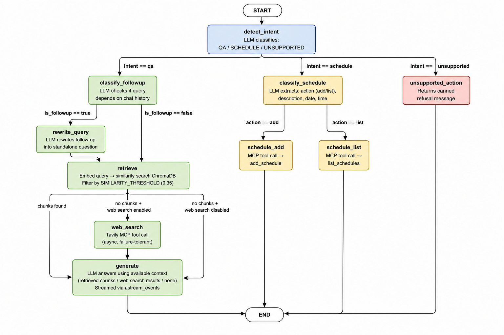
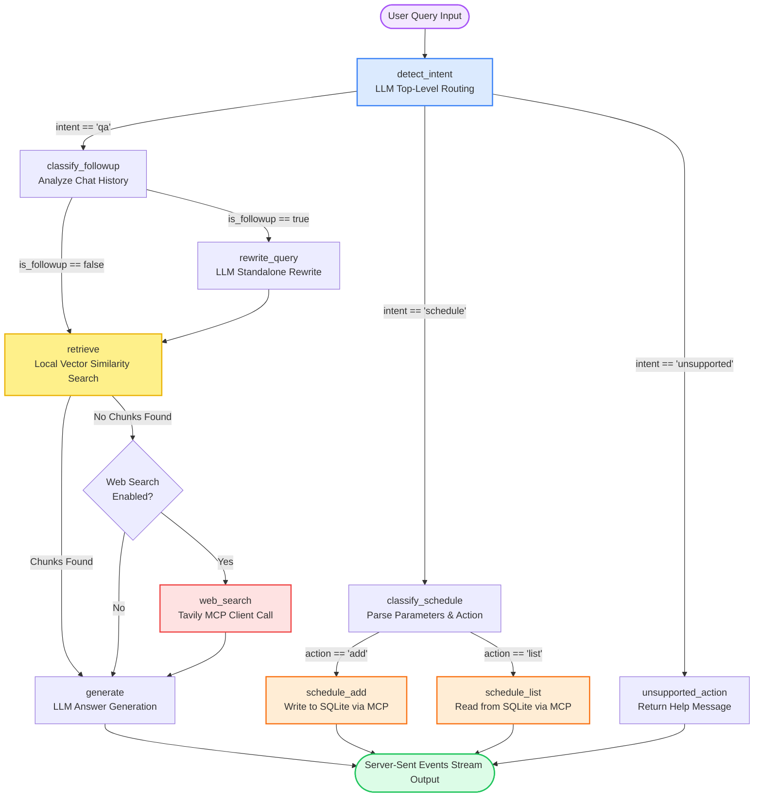

# Agentic RAG Platform with Integrated Scheduling & Web Fallback

Welcome to the **Agentic RAG Platform**, a self-contained, enterprise-ready service that implements a structured **Retrieval-Augmented Generation** engine. 

The platform features an agentic routing engine built on **FastAPI** and **LangGraph**, a modern **React/Vite** frontend, and a self-hosted **Schedule MCP Server** (Model Context Protocol). Users can upload documents (PDF, DOCX, TXT, MD), query them with conversational context, manage their calendar schedules, and enjoy real-time token-level streaming and status updates.

---

## 1. Introduction & Overview

Modern LLMs suffer from hallucination and lack up-to-date or domain-specific knowledge. Retrieval-Augmented Generation (RAG) resolves this by grounding the model's responses in external data.

This platform goes beyond standard RAG by introducing **Agentic Workflows**:
1. **Dynamic Routing**: An LLM acts as an orchestrator, classifying the user's intent to route the query to a Document QA pipeline, a Calendar Scheduling pipeline, or an Unsupported action handler.
2. **Web Fallback (via MCP)**: If a Document QA query cannot be answered using the local knowledge base, the agent automatically falls back to an external web search using Tavily via the **Model Context Protocol (MCP)**.
3. **Tool Use & First-Party Servers**: When scheduling is requested, the agent invokes a self-hosted MCP server to add or list appointments in a persistent SQLite database.
4. **Interactive UI**: A React frontend connects to a Server-Sent Events (SSE) stream, rendering the agent's step-by-step "thought process" and streaming tokens as they generate.

---

## 2. Core Concepts & Theoretical Flow

Understanding the concepts behind each stage of the user query's lifecycle is key to appreciating how the pipeline operates:

### A. Intent Detection
Before executing any retrieval or LLM generation, the query is passed to the **Intent Detection** node. An LLM acts as a router, classifying the input into one of three intents:
*   **QA (`qa`)**: The user is asking a question that requires searching documents or the web.
*   **Schedule (`schedule`)**: The user wants to manage their calendar (e.g., "Add dentist appt on Monday at 3pm", "What are my schedules today?").
*   **Unsupported (`unsupported`)**: The query falls outside the platform's capabilities (e.g., image generation, arbitrary code execution), allowing the system to fail gracefully with a canned, helpful refusal rather than wasting LLM tokens.

### B. Follow-up Classification & Query Rewriting
For QA queries, semantic search over historical context can fail if users use pronouns or follow-up phrases (e.g., "What is its duration?" after asking about "6th Semester Curriculum").
*   **Follow-up Detection**: If there is chat history, the LLM determines whether the new query depends on the previous turns.
*   **Query Rewriting**: If a follow-up is detected, the LLM combines the chat history and the current query into a single, self-contained **standalone query** (e.g., "What is the duration of the 6th Semester Curriculum?"). This rewritten query is then used for embedding generation and retrieval, ensuring the search index matches the true intent.

### C. Embedding & Similarity Matching
*   **Vector Embeddings**: Raw text chunks are converted into dense, multi-dimensional numerical vectors (384 dimensions) using the local `all-MiniLM-L6-v2` SentenceTransformer model. Words with similar meanings are mapped to vectors that lie close to each other in vector space.
*   **ChromaDB Vector Store**: Acts as the database for embeddings, supporting high-speed vector index searches.
*   **Cosine Similarity & Thresholding**: When searching, the query is embedded, and the vector store calculates the cosine distance between the query vector and document vectors. The distance is mapped to a similarity score between `0` (totally different) and `1` (identical). Only chunks exceeding the `SIMILARITY_THRESHOLD` (default: `0.35`) are retrieved.

### D. Web Search Fallback (Model Context Protocol)
If the similarity search returns **zero chunks** (meaning the document index has no relevant information), the agent branches into the **Web Search Fallback** node.
*   **MCP (Model Context Protocol)**: A standardized open standard protocol that connects AI models to external tools. 
*   **Tavily Search**: The backend uses an MCP client to call a Tavily search tool, pulling real-time context from the internet. This context is formatted and sent to the LLM to answer the query, ensuring the user gets an answer even if the local database is dry.

### E. Grounded Generation & SSE Streaming
*   **Grounded Prompts**: The LLM (Llama 3.3 70B via Groq) is provided with the retrieved context (from documents or the web) and instructed to answer the question **strictly** using that information. If the answer cannot be found in the context, it must admit it doesn't know.
*   **Streaming SSE (Server-Sent Events)**: Instead of waiting for the full response, the FastAPI endpoint utilizes `astream_events` from LangGraph. It streams:
    1.  **Status Events**: Showing which node is running (e.g., "Searching the knowledge base...", "Generating the answer...").
    2.  **Token Events**: Emitting individual characters of the LLM's response in real time for a snappy UX.
    3.  **Done Events**: Delivering the complete answer and the specific source citations (filename, text snippet, similarity score).

### F. Self-Hosted MCP Scheduling
If the intent is classified as `schedule`, the LLM extracts structured parameters (action: `add`/`list`, description, date, and time).
*   The system communicates with a **self-hosted Schedule MCP server** running as a separate service on port `8100`.
*   The server handles standard database operations (via `SQLAlchemy` and `aiosqlite`) to save or retrieve appointments in a shared SQLite database (`data/app.db`).

---

## 3. Query Flow Tree Diagram

The following tree diagram illustrates how a user's query flows through the LangGraph state machine, highlighting the routing decisions and terminal endpoints.

<p align="center">
  
</p>



---

## 4. Startup & Running Guide

To run the application locally, you must spin up three processes:
1. **Schedule MCP Server** (handles calendar commands)
2. **FastAPI Backend** (coordinates logic, vector database, and LangGraph flow)
3. **React/Vite Frontend** (provides the interactive user interface)

### Prerequisites
*   **Python 3.11** or **3.12**
*   **Node.js (v18+)** & npm
*   A **Groq API Key** (for fast, low-latency inference)
*   A **Tavily API Key** (optional, required for the web search fallback)

---

### Step 1: Clone and Set Up Environments

First, set up your Python virtual environment and install backend dependencies from the root directory:

```bash
# Create and activate virtual environment
python -m venv .venv
.venv\Scripts\activate          # Windows
# source .venv/bin/activate     # macOS/Linux

# Install dependencies
pip install -r requirements.txt
```

#### Configuration Files (.env)
You must set up `.env` files for both the backend and the schedule MCP server.

1.  **Backend Environment File**:
    Copy the example template to `.env` in the root folder:
    ```bash
    cp .env.example .env
    ```
    Open `.env` and fill in your keys:
    ```env
    GROQ_API_KEY=gsk_your_groq_api_key_here
    TAVILY_API_KEY=tvly_your_tavily_api_key_here
    ```

2.  **Schedule Server Environment File**:
    Copy the example template to `.env` in the `schedule_mcp_server` folder:
    ```bash
    cp schedule_mcp_server/.env.example schedule_mcp_server/.env
    ```
    *(The default settings point to `data/app.db` which is shared with the backend. You can leave these as default.)*

---

### Step 2: Start the Schedule MCP Server

The Schedule server is a standalone process exposing tools to read/write appointment schedules via streamable HTTP.

From the **project root folder** (with your virtual environment active):

```bash
python -m schedule_mcp_server.server
```

You should see logs indicating the server is running:
`INFO:schedule_mcp_server:Starting schedule MCP server on http://127.0.0.1:8100/mcp`

---

### Step 3: Start the FastAPI Backend

The backend runs on port `8000`. On first startup, it will download the embedding model (~90 MB) and initialize the database.

From the **project root folder** (in a separate terminal window, with active virtual environment):

```bash
uvicorn app.main:app --reload --port 8000
```

Once loaded, the server will start. You can view the interactive Swagger API documentation at:
*   **http://localhost:8000/docs**

---

### Step 4: Start the React Frontend

Open a third terminal, navigate to the frontend directory, install dependencies, and launch Vite:

```bash
cd frontend
npm install
npm run dev
```

The frontend will start on:
*   **http://localhost:5173**

Open this address in your browser to interact with the chatbot interface.

---

## 5. Other CLI & Utility Commands

### Bulk Document Ingestion
To populate the vector database without uploading files one-by-one in the UI, you can run a bulk ingestion command on a local folder:

```bash
# Ingests all PDF, DOCX, TXT, and MD files in the "data" directory
python -m scripts.ingest_folder data
```

### Smoke Test (Direct Execution)
You can bypass the network and API layers entirely to run the RAG pipeline directly from Python:

```python
# Create a temporary script: smoke.py
from app.state import build_app_state
import asyncio

async def test_smoke():
    rag = build_app_state()
    # Ingest document
    rag.document_controller.ingest_document("data/sample.txt", document_id="doc-1")
    
    # Query graph
    async for event in rag.chat_controller.astream_answer(
        query="What is in the sample document?",
        user_id="test_user",
        document_id="doc-1"
    ):
        print(event)

if __name__ == "__main__":
    asyncio.run(test_smoke())
```
Run it with:
```bash
python smoke.py
```

### Running Tests
The project features a suite of unit and integration tests. Run them from the project root using:

```bash
pytest
```

---

## 6. Workspace Directory Structure

Below is an overview of the key directories and modules in the codebase:

```
rag_structured/
├── app/
│   ├── api/                     # HTTP Endpoints, routers, and dependencies
│   │   ├── deps.py              # FastAPI dependency providers (CORS, app state)
│   │   └── routes.py            # API request handlers (upload, chat, auth)
│   ├── controllers/             # Orchestrates multi-step business logic
│   │   ├── chat_controller.py   # Runs the LangGraph query pipeline
│   │   └── document_controller.py # Coordinates loading, embedding, and saving docs
│   ├── core/                    # Infrastructure, database configurations, and MCP base clients
│   │   ├── mcp/                 # MCP client connection factories
│   │   └── logging_config.py    # Structured logging configuration
│   ├── graph/                   # LangGraph compilation & workflow logic
│   │   ├── build.py             # Wires state nodes, transitions, and conditional routes
│   │   ├── nodes.py             # Definitions of graph nodes (intent, QA, scheduling)
│   │   └── state.py             # TypedDict schema defining state flowing between nodes
│   ├── models/                  # Pydantic schemas (wire request/response models)
│   ├── services/                # Specialized domain logic
│   │   ├── embedding_service.py # Loads local model to embed strings into vectors
│   │   ├── ingestion_service.py # Parses documents (PDF, Docx, etc.) and chunks them
│   │   ├── retrieval_service.py # Matches search queries against indexed vectors
│   │   ├── schedule_service.py  # Communicates with self-hosted schedule MCP
│   │   └── web_search_service.py# Communicates with Tavily search MCP
│   ├── vectorstores/            # Storage abstractions and implementations
│   │   ├── base.py              # BaseVectorStore interface definition
│   │   ├── chroma_store.py      # ChromaDB concrete implementation
│   │   └── factory.py           # Instantiates and caches the vector store instance
│   └── main.py                  # FastAPI entrypoint, lifecycles, and CORS mounting
├── data/                        # Contains database files (app.db), uploads, and Chroma data
├── frontend/                    # Vite + React UI application
├── schedule_mcp_server/         # Standalone FastMCP Schedule service
│   ├── database.py              # SQLAlchemy database setup for appointments
│   ├── repository.py            # SQLite CRUD query operations
│   └── server.py                # Registers MCP tools (add_schedule, list_schedules)
├── scripts/                     # Utility CLI scripts (e.g. bulk folder ingestion)
├── tests/                       # Complete pytest suite
└── requirements.txt             # Primary application python package listing
```
